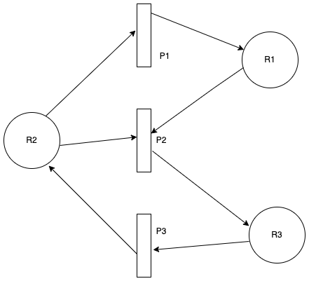

# PetriNetRunner
Runs PN analyses on PN nets using LoLA. LoLA was made available in this repo as a zip for easy script execution. Please refer to https://www.informatik.uni-hamburg.de/TGI/PetriNets/tools/db/lola.html for official download. 
Place the folder PNs with all the code files in the examples folder available after unzipping the lola-2.0.zip. 

## A trivial deadlocking example

The PN model: 

How to run the LoLA file: 

Open the command prompt/terminal in the respective directory where .lola files are placed and run this command 

### lola sample-deadlock.lola --formula="EF DEADLOCK" 

## The 5 dining philosophers cant eat

If each philosopher picks up their left fork, does some thinking, and then tries to pick up the other fork when done, they'd realize no one can eat. After all, the one to the right needs to put down the fork they picked up in order to allow the other to eat. But how can they put down the fork they picked up if they havent eaten themselves? 

The PN model:  

How to run the LoLA file: 
Open the command prompt/terminal in the respective directory where .lola files are placed and run this command 
### lola 5P-deadlock.lola --formula="EF DEADLOCK" 

We can even test the code on different formulas. For that, Following command needs to be executed

### lola 5P-deadlock.lola -f 5P-deadlock.formula -s

## 4 out of 5 philosophers can eat

One way to solve the dining philosopher problem is to ensure that each philosopher picks up both forks on either side simultaneously when they are done thinking and ready to eat instead of locking up resources when they arent quite ready to use them. 

The PN model:  

How to run the LoLA file: 
Open the command prompt/terminal in the respective directory where .lola files are placed and run this command 

### lola 5P-nonDeadlock.lola --formula="EF DEADLOCK"
This command will output, whether the submitted code has deadlock or not. 

We can even test the code on different formulas as well. To test that, Following command needs to be executed

### lola 5P-nonDeadlock.lola -f 5P-nonDeadlock.formula -s

